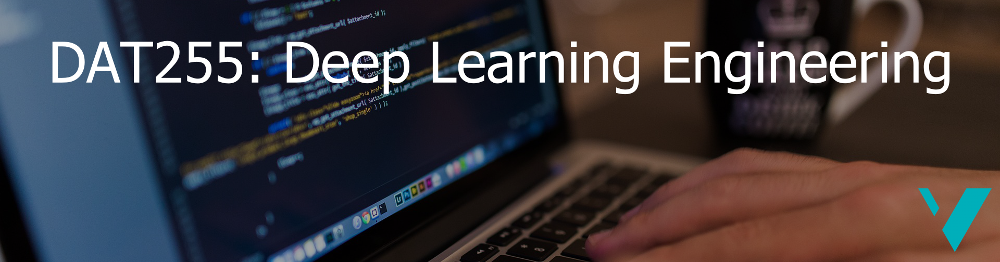

# DAT255-2022: Deep learning engineering

Various material used in the course DAT255 at HVL. More information can be found on the course website: https://hvl.instructure.com/courses/18347. 

## Table of contents

**[Mini-projects](./mini_projects/)**: Examples and other material related to the course mini projects

**[nnet_building_blocks](./nnet_building_blocks/)**: An introduction to the building blocks of neural networks (in PyTorch)

**[CNN_feature_extraction](./CNN_feature_extraction/)**: Changing input representations and extracting learned representations from deep neural networks

_More TBA_